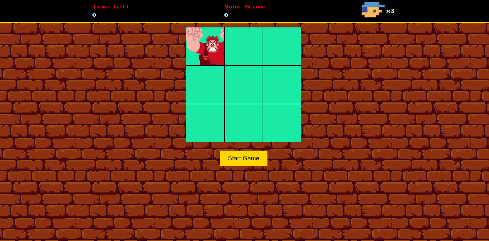
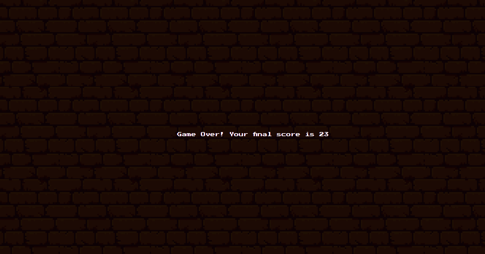

# Detona Ralph Game

This project is a simple browser-based game inspired by the movie *"Wreck-It Ralph"*. The game involves hitting an enemy character that appears randomly in one of the squares on the game board. The player has a limited amount of time to score as many points as possible by clicking on the enemy character.

## Project Structure

The project has the following structure:

### Files

- **[index.html](index.html)**: The main HTML file that sets up the structure of the game interface.
- **[src/images/](src/images/)**: Contains images used in the game.
  - **[ralph.png](src/images/ralph.png)**: The enemy character image.
  - **[player.png](src/images/player.png)**: The player character image.
- **[src/scripts/engine.js](src/scripts/engine.js)**: The JavaScript file that contains the game logic, including [`initialize()`](src/scripts/engine.js#L35).
- **[src/sounds/](src/sounds/)**: Directory for game sound files.
- **[src/styles/reset.css](src/styles/reset.css)**: CSS file to reset default browser styles.
- **[src/styles/styles.css](src/styles/styles.css)**: CSS file that contains the styles for the game interface.

## Game Mechanics

1. The game starts when the "Start Game" button is clicked, invoking [`initialize()`](src/scripts/engine.js#L35).
2. The enemy character appears randomly in one of the squares on the game board using [`randomSquare()`](src/scripts/engine.js#L21).
3. The player must click on the enemy character to score points, handled by [`addListenerHitBox()`](src/scripts/engine.js#L29).
4. The game has a countdown timer managed by [`countDown()`](src/scripts/engine.js#L13), and the game ends when the timer reaches zero.
5. The final score is displayed when the game is over.

## Images

- **[ralph.png](src/images/ralph.png)**: 
- **[player.png](src/images/player.png)**: 
- **[img2.png](assets/img2.png)**: 
- **[img1.png](assets/img1.png)**: 

## How to Run

1. Open **[index.html](index.html)** in a web browser.
2. Click the "Start Game" button to begin playing.
3. Enjoy the game!

## Additional Information

- **Styles**: The styling is handled in [src/styles/reset.css](src/styles/reset.css) and [src/styles/styles.css](src/styles/styles.css).
- **Sounds**: Game sounds are located in [src/sounds/](src/sounds/).
- **Images**: All game images are stored in [src/images/](src/images/).

Feel free to explore the codebase and modify the game mechanics or aesthetics to your liking!